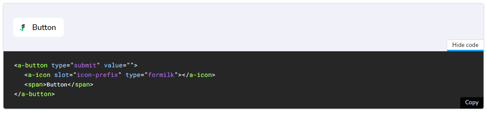
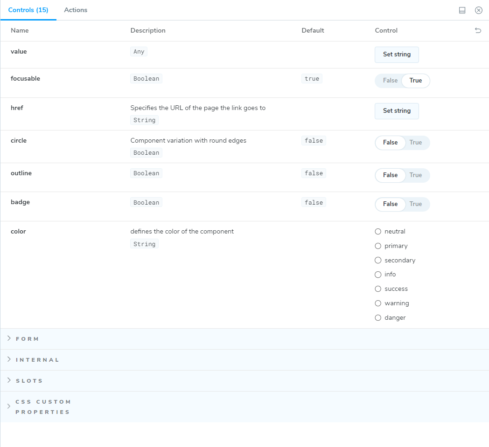

# @atomico/storybook

@atomico/storybook posee como objetivo:

1. Entregar un decorador para renderizar el JSX/HTML y serializar el codigo de las historias.
2. Entregar un generador de argTypes/args segun el componente dado.

## Decorador para renderizar el JSX/HTML&#x20;

```javascript
import { decorador } from "@atomico/storybook";
```

`decorator` permite renderizar el JSX/HTML usando el render de Atomico, este también permite serializar el JSX y HTML declarado en su historia, ejemplo:

### Ejemplo de renderización y serialización del JSX

<figure><figcaption></figcaption></figure>


La serialización del JSX ocurre solo si se define`parameters.docs.source = 'jsx'` por historia o global en `.storybook/preview.js.`

Esta funcionalidad solo es compatible con versiones >= atomico@1.70.0 gracias a la [característica de nombres automáticos según definición del componente](https://atomico.gitbook.io/doc/api/virtualdom/advanced#class-name-inheritance)


### Ejemplo de renderización y serialización del HTML

<figure><figcaption></figcaption></figure>

## Generador de argTypes/args según el componente dado

```javascript
import { define } from "@atomico/storybook";
import { Button } from "./button";

export default {
    title: "Component/Button"
    ...define(Button) 
}
```

### Ejemplo&#x20;

<figure><figcaption></figcaption></figure>


