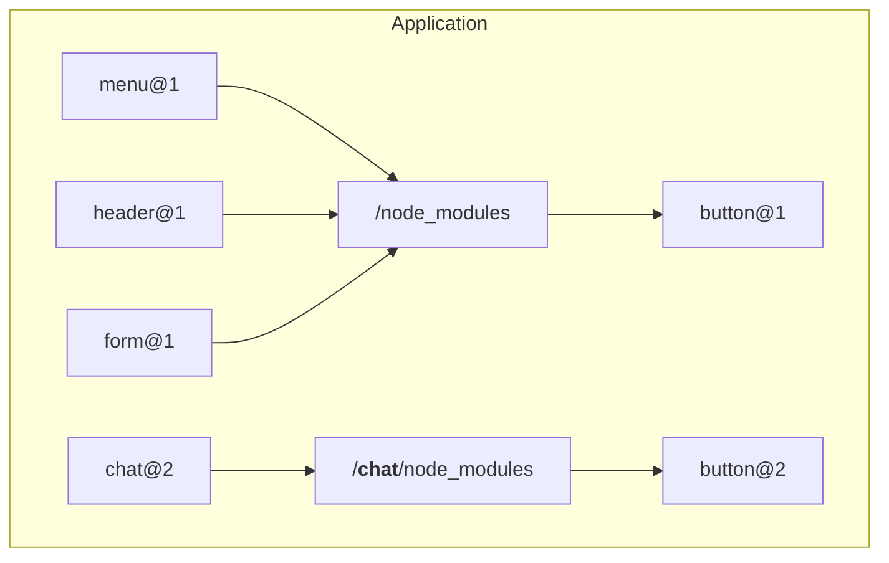

# @atomico/wrapper

Additionally, this package offers other utilities.

### @atomico/wrapper/allow-deduple&#x20;

This is an optional import module that allows coexistence of multiple versions of webcomponents in JSX-based environments (Atomico, React, or Preact) and Vue.

#### Let's first understand what is the problem of duplicate webcomponents:



According to the graph above the menu, header and form components depend on the version 1 button which exists in the root dependencies (/node\_modules) but the chat component depends on the version 2 button, NPM will resolve this correctly, but still the webcomponents will point to the same tagName and that will generate an error at registration time:

<figure><figcaption></figcaption></figure>

#### Solution

import `allow-deduple`

```tsx
import "@atomico/wrapper/allow-deduple";
```

The above module allows 2 webcomponents of different versions to coexist, but only when instantiating them through the JSX or Vue syntax (Only when using @atomico/vue)

#### Instantiate via JSX

```tsx
<MyComponent/>
```

