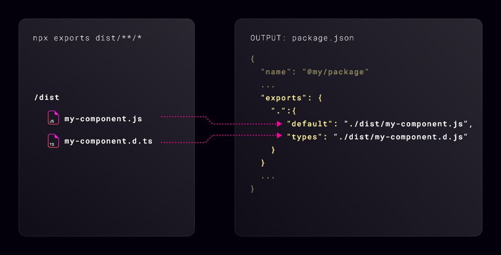

# @atomico/exports

Atomico export is a solution that parses the output of compilers like vite, esbuild, typescript, rollup or other bundle tool.

Atomico export is also compatible with uncompiled code (standard Javascript).

<figure><figcaption></figcaption></figure>

### The objective of Atomico/exports

1. Make your package look elegant when imported by other applications, example:

```typescript
import { Button } from "components/dist/button.js"; // ❌
import { Button } from "components/button"; // ✅
```

2\. Create wrappers for React/Preact/Vue of webcomponents created with Atomico

```typescript
import { Button } from "components/button/react"; 
```

### Installation



```bash
npm install -D @atomico/exports
```



```javascript
{
 /**
  * ⚠️ The --types flag requires the installation of @typescript
  */
 "scripts": {
   "exports": "exports dist/**/* types/**/*"
 }
}
```




`@atomico/exports` is distributed as ESM, so your `package.json` must define the property `"type":"module"` for its use.



[atomico-exports.md](atomico-exports.md)



[wrapper-for-react.md](wrapper-for-react.md)

