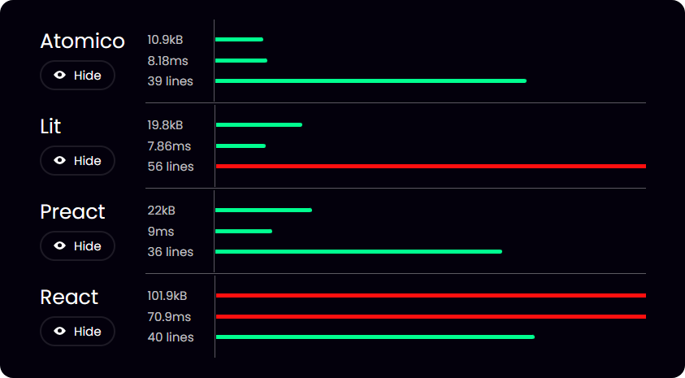

# You can create amazing webcomponents

We invite you to discover part of the development experience you will get with Atomico:

### Create really fast webcomponents

**Quick components to write** since with Atomico you will require fewer lines of code to declare your webcomponents which will help you to be more productive&#x20;

**Fast in performance**, since Atomico sends less code to the client, making your interface load quickly

<figure><figcaption></figcaption></figure>

### Create web components with less code

This is thanks to a functional orientation inherited from React hooks plus some internal optimization from Atomic that ease the process of shaking the tree at compile time, achieving in this way sending the client a highly optimized JS that only has what you really use

### Create webcomponents with a functional orientation

This is thanks to Atomico's reliance on React hooks syntax plus the ability to completely eliminate the need for this when using webcomponents.

### Create friendly webcomponents for React, Vue and other libraries

Atomic offers additional coverage for native behavior for React and Vue, allowing your component to be more embed-friendly, example React:

```tsx
import { Button } from "@formas/button/react";

function App(){
   return <>
      <h1>React App!</h1>
      <Button onClick={()=>console.log("Click!")}>
         Submit
      </Button>
   </>
}
```

